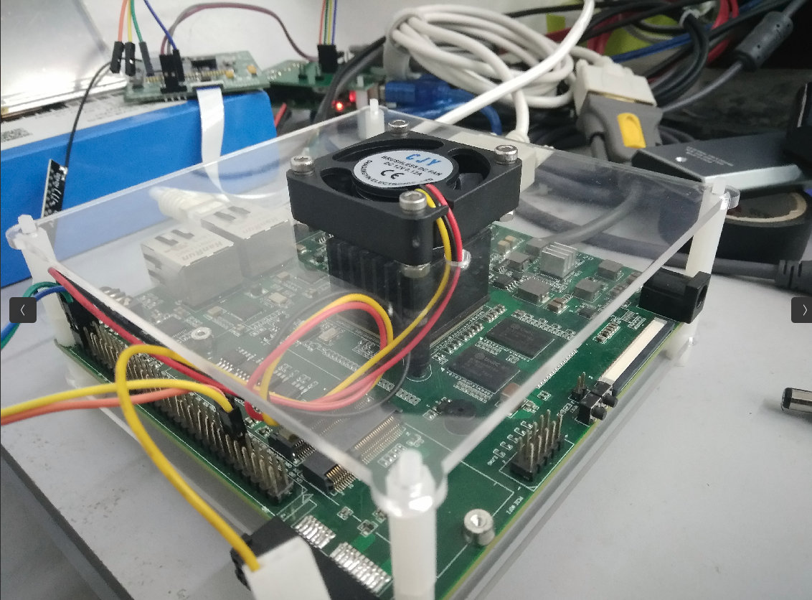

# loongson-pi2

# 说明：
- 龙芯派2代顶板亚克力板CAD设计文件
- 龙芯派自带的亚克力顶板没有预留风扇安装孔位，此设计文件增加了4X4风扇的安装孔位

# 使用方法：  
1.某宝搜索亚克力板定制  
2. 将本文件发送给店家，1：1制作  
3. 付款  
4. 购买4cm*4cm的风扇（注意是否送固定螺丝）
5. star 并follow me   》.《  

# 效果图：  

